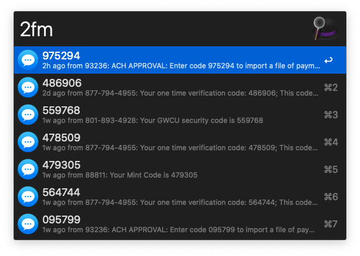
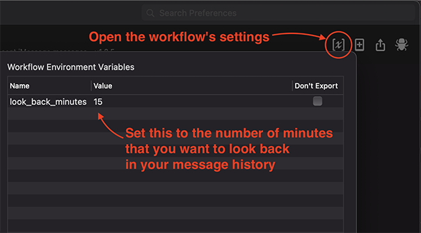

# iMessage 2FA Workflow for Alfred

Find two-factor authentication codes in your recent iMessage messages.

## Requirements

* `php` must be installed on your system
  * macOS has not had `php` preinstalled since Monterey (v12)
    * This is also the case for macOS Ventura (v13), Sonoma (v14), and Sequoia (v15)
  * We recommend using [Homebrew](https://brew.sh) to install `php`
    * To install Homebrew, follow the instructions on the "Install Homebrew" section of the [Homebrew website](https://brew.sh)
    * Once you have installed Homebrew, install `php` by running `brew install php`
* You **MUST** grant Full Disk Access to Alfred
  * This is required because your messages are stored in the file `~/Library/Messages/chat.db`, which Alfred cannot read without having Full Disk Access
  * [See here for instructions on granting Full Disk Access to Alfred](https://www.alfredapp.com/help/getting-started/permissions/#full-disk)

## Installation

1. [Download the latest version of the workflow](https://github.com/squatto/alfred-imessage-2fa/releases/latest/download/iMessage.2FA.alfredworkflow)
2. Install the workflow by double-clicking the `.alfredworkflow` file
3. You can add the workflow to a category, then click "Import" to finish importing. You'll now see the workflow listed in the left sidebar of your Workflows preferences pane.

## Configuration

* By default, only messages received in the past 15 minutes will be searched
* You can change how many minutes to look back by changing the `look_back_minutes` workflow variable
* Tutorial: [How to set workflow variables](https://www.alfredapp.com/help/workflows/advanced/variables/#environment)

## Usage

Type `2fm` to view the most recent two-factor authentication codes from iMessage messages.

Select a 2FA code and do one of the following:

* Press `<enter>` to copy it to your clipboard
* Press `⌘+<enter>` (command + enter) to copy it to your clipboard and paste it into the active app window using simulated keystrokes
  * Some websites (e.g. Wells Fargo online banking) don't support pasting a 2FA code, so this will instead simulate typing the code
  * In order for this to work, you MUST grant Alfred automation access to `System Events`. If you haven't already done so, you will be prompted to grant access. [See here for more information about Alfred automation.](https://www.alfredapp.com/help/getting-started/permissions/#automation) 
* Press `⌥+<enter>` (option + enter) to copy it to your clipboard and paste it into the active app window using the system paste (similar to pressing `⌘+V`)

## Compatibility

This workflow was developed for use with Alfred 5. It also works with Alfred 4.

## Contributors

A huge thank you to our contributors!

* [luckman212](https://github.com/luckman212)
* [manonstreet](https://github.com/manonstreet)
* [cmer](https://github.com/cmer)
* [eruizdechavez](https://github.com/eruizdechavez)
